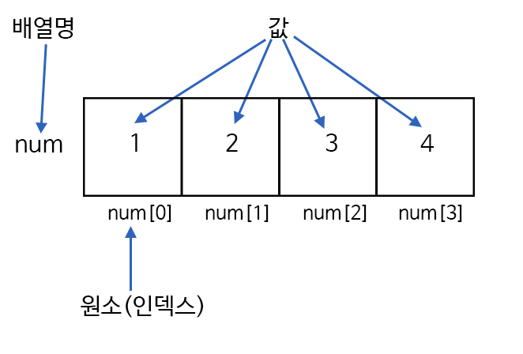
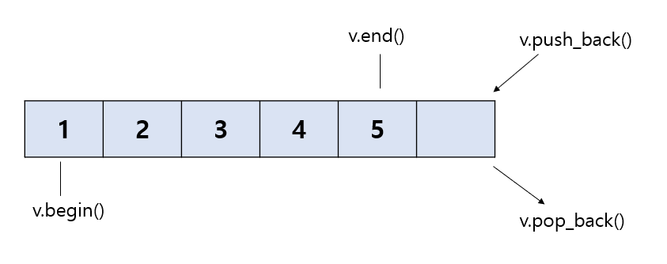
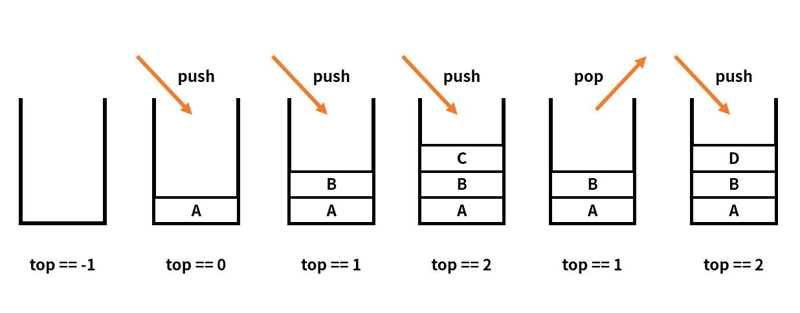
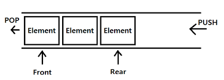

# 자료구조

<br>

## 배열과 리스트 그리고 벡터

<br>

### 배열
> 메모리의 연속 공간에 값이 채워져 있는 형태의 자료구조

<br>



<br>

1. 인덱스를 사용하여 값에 바로 접근할 수 있다
2. 새로운 값을 삽입하거나 특정 인덱스에 있는 값을 삭제하기 어렵다. 값을 삽입하거나 삭제하려면 해당 인덱스 주변에 있는 값을 이동시키는 과정이 필요하다
3. 배열의 크기는 선언할 때 지정할 수 있으며, 한 번 선언하면 크기를 늘리거나 줄일 수 없다
4. 구조가 간단하므로 코딩 테스트에서 많이 사용한다

<br>

### 리스트
> 값과 포인터를 묶은 노드라는 것을 포인터로 연결한 자료구조

<br>

1. 인덱스가 없으므로 접근하려면 Head 포인터부터 순서대로 접근해야 한다. 다시 말해 값에 접근하는 속도가 느리다
2. 포인터로 연결되어 있으므로 데이터를 삽입하거나 삭제하는 연산 속도가 빠르다
3. 선언할 때 크기를 별도로 지정하지 않아도 된다. 다시 말해 리스트의 크기는 정해져 있지 않으며, 크기가 변하기 쉬운 데이터를 다룰 때 적절하다.
4. 포인터를 저장할 공간이 필요하므로 배열보다 구조가 복잡하다.

<br>

### 벡터
> C++ STL에 있는 자료구조 컨테이너 중 하나로 사용자가 손쉽게 사용하기 위해 정의된 클래스이다. 기존의 배열과 같은 특징을 가지면서 배열의 단점을 보완한 `동적 배열`의 형태

<br>



<br>

1. 동적으로 원소를 추가할 수 있다. 즉, 크기가 자동으로 늘어난다
2. 맨 마지막 위치에 데이터를 삽입하거나 삭제할 때는 문제가 없지만 중간 데이터의 삽입 삭제는 배열과 같은 메커니즘으로 동작한다
3. 배열과 마찬가지로 인덱스를 이용하여 각 데이터에 직접 접근할 수 있다.

<br>

### 벡터 사용법

<br>

```cpp
// 선언
vector<int> A;              // vector<자료형> 변수 이름; 형태로 선언

// 삽입 연산
A.push_back(1);             // 마지막에 1 추가
A.insert(A.begin(), 7);     // 맨 앞에 7 삽입
A.insert(A.begin()+2, 10);  // index 2 위치에 10 삽입

// 값 변경

A[4] = -5;                  // index 4 위치의 값을 -5로 변경

// 삭제 연산
A.pop_back();               // 마지막 값 삭제
A.erase(A.begin()+3);       // index 3에 해당하는 원소 삭제
A.clear();                  // 모든 값 삭제

// 정보 가져오기
A.size();                   // 데이터 개수
A.front();                  // 처음 값
A.back();                   // 마지막 값
A[3];                       // index 3에 해당하는 값
A.at(5);                    // index 5에 해당하는 값
A.begin();                  // 첫 번째 데이터의 iterator
A.end();                    // 마지막 데이터의 iterator

```

<br>

## 구간 합
> 구간 합은 합 배열을 이용하여 시간 복잡도를 더 줄이기 위해 사용하는 특수한 목적의 알고리즘

<br>

### 구간 합의 핵심 이론

- 합 배열 S의 정의
> $S[i] = A[0] + A[1] + A[2] + ... + A[i-1] + A[i]$

<br>

- 합 배열은 기존의 배열을 전처리한 배열이라 생각하면 된다
- 합 배열을 미리 구해두면 기존 배열의 일정 범위의 합을 구하는 시간 복잡도가 O(N)에서 O(1)로 감소한다

<br>

- 합 배열 S를 만드는 공식
> $S[i] = S[i-1] + A[i]$

<br>

- 구간 합을 구하는 공식
> $S[j] - S[i-1]$     // i번째는 포함해야하기 때문

<br>

## 투 포인터
- 투 포인터는 2개의 포인터로 알고리즘의 시간 복잡도를 최적화합니다.

<br>

## 슬라이딩 윈도우
- 슬라이딩 윈도우 알고리즘은 2개의 포인터로 범위를 지정한 다음 범위를 유지한 채로 이동하여 문제를 해결합니다. 투 포인터 알고리즘과 비슷하고 원리도 간단합니다

<br>

## 스택과 큐

<br>

### 스택(Stack)
- 스택은 삽입과 삭제 연산이 후입선출(LIFO: Last In Firt Out)로 이뤄지는 자료구조이다.
- 삽입과 삭제는 한쪽에서만 진행된다

<br>



<br>

### 스택 용어
- top: top 위치에 현재 있는 데이터를 단순 확인하는 연산
- push: top 위치에 새로운 데이터를 삽입하는 연산
- pop: top 위치에 현재 있는 데이터를 삭제하고 확인하는 연산

<br>

### ***스택은 깊이 우선 탐색(DFS), 백트래킹 종류의 코딩 테스트에 효과적이다***

<br>

### 큐(Queue)
- 큐는 삽입과 삭제 연산이 선입선출(FIFO: First In First Out)로 이뤄지는 자료구조이다.
- 삽입과 삭제가 back, front에서 각각 진행된다

<br>



<br>

### 큐 용어
- push: back 부분에 새로운 데이터를 삽입하는 연산
- pop: front 부분에 있는 데이터를 삭제하고 확인하는 연산

<br>

### ***큐는 너비 우선 탐색(BFS)에서 잘 사용된다***
